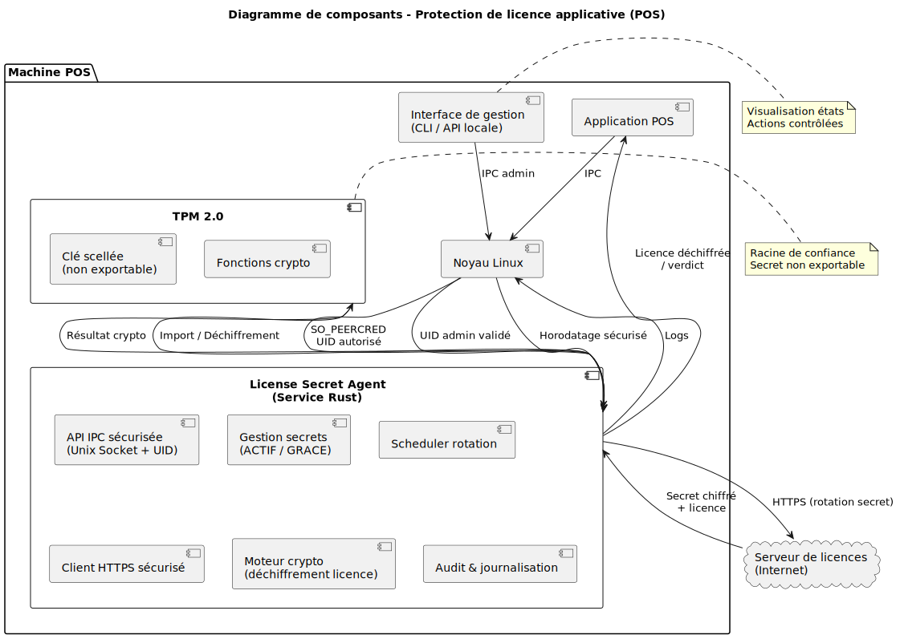

# License Secret Agent

Service de protection de licences applicatives pour environnements POS (Point of Sale).

## Description




License Secret Agent est un service système sécurisé qui gère le secret de déchiffrement des licences applicatives. Il garantit :

- **Sécurité maximale** : Secret stocké dans TPM 2.0, jamais en clair
- **Continuité** : Rotation sans coupure, mode dégradé
- **Traçabilité** : Logs d'audit complets
- **Résilience** : Gestion d'erreurs et récupération automatique

## Architecture

Voir la documentation complète dans les fichiers Markdown :
- `00-INDEX-SYNTHESE.md` : Vue d'ensemble
- `01-ANALYSE-RISQUES.md` : Analyse des risques
- `02-ARCHITECTURE-CIBLE.md` : Architecture détaillée
- `03-FLUX-CRYPTOGRAPHIQUES.md` : Flux cryptographiques
- `04-CYCLE-VIE-SECRET.md` : Cycle de vie des secrets
- `05-ROTATION-SANS-COUPURE.md` : Stratégie de rotation
- `06-MODE-DEGRADE.md` : Mode dégradé
- `07-INTERFACE-GESTION.md` : Interface de gestion
- `08-CHOIX-TECHNIQUES-ANTI-PATTERNS.md` : Choix techniques

## Prérequis

- Linux avec systemd
- TPM 2.0 (recommandé) ou fallback chiffrement logiciel
- Rust 1.70+ (pour compilation)
- Bibliothèques TPM (tpm2-tss)

## Compilation

```bash
# Compiler en mode release
cargo build --release

# Le binaire sera dans target/release/license-agent
```

## Installation

### Option 1 : Package .deb (Recommandé pour Debian/Ubuntu)

```bash
# Construire le package
./scripts/build-package.sh 0.1.0 amd64

# Installer
sudo dpkg -i target/package/license-secret-agent_0.1.0_amd64.deb
sudo apt-get install -f  # Installer dépendances si nécessaire
```

### Option 2 : Tarball (Distribution générique)

```bash
# Construire le tarball
./scripts/build-tarball.sh 0.1.0 x86_64

# Extraire et installer
tar -xzf target/tarball/license-secret-agent-0.1.0-x86_64.tar.gz
cd license-secret-agent-0.1.0-x86_64
sudo ./scripts/install.sh
```

### Option 3 : Installation manuelle

```bash
# Exécuter le script d'installation (nécessite root)
sudo ./deploy/install.sh
```

Voir [PACKAGING.md](PACKAGING.md) pour plus de détails sur la création de packages.

## Configuration

1. Modifier `/etc/license-agent/config.toml` avec vos paramètres
2. Installer certificats client dans `/etc/license-agent/`
3. Configurer l'ID agent unique

Exemple de configuration :
```toml
[server]
url = "https://license-server.example.com"
cert_pin = "sha256:..."

[agent]
id = "pos-001"
rotation_interval = 86400
grace_period = 604800
```

## Utilisation

### Démarrer le service

```bash
sudo systemctl start license-agent
sudo systemctl enable license-agent  # Au démarrage
```

### Vérifier le statut

```bash
sudo systemctl status license-agent
sudo journalctl -u license-agent -f
```

### Utilisation depuis application POS

```rust
use std::os::unix::net::UnixStream;
use serde_json;

let mut stream = UnixStream::connect("/var/run/license-agent.sock")?;

let request = ValidateLicenseRequest {
    license_token: token_bytes,
    nonce: generate_nonce(),
};

let request_json = serde_json::to_vec(&request)?;
stream.write_all(&(request_json.len() as u32).to_be_bytes())?;
stream.write_all(&request_json)?;

// Lire réponse...
```

## Structure du Projet

```
license-secret-agent/
├── src/
│   ├── main.rs           # Point d'entrée
│   ├── lib.rs            # Exports modules
│   ├── config.rs         # Configuration
│   ├── types.rs          # Types de données
│   ├── tpm.rs            # Gestionnaire TPM
│   ├── secret.rs         # Gestionnaire secrets
│   ├── license.rs        # Validateur licences
│   ├── rotation.rs       # Gestionnaire rotation
│   ├── ipc.rs            # Serveur IPC
│   ├── audit.rs          # Logger audit
│   └── core.rs           # Moteur principal
├── deploy/
│   ├── install.sh        # Script installation
│   ├── license-agent.service  # Service systemd
│   └── config.toml.example    # Configuration exemple
└── Cargo.toml            # Dépendances Rust
```

## Sécurité

⚠️ **IMPORTANT** : Ce logiciel gère des secrets critiques. Suivez strictement les bonnes pratiques :

- Ne jamais stocker le secret en clair
- Utiliser TPM 2.0 si disponible
- Configurer permissions strictes (600)
- Auditer régulièrement les logs
- Maintenir le système à jour

## Développement

### Tests

```bash
cargo test
```

### Formatage

```bash
cargo fmt
```

### Linting

```bash
cargo clippy
```

## Licence

MIT OR Apache-2.0

## Support

Pour toute question ou problème, consultez la documentation dans les fichiers Markdown.
